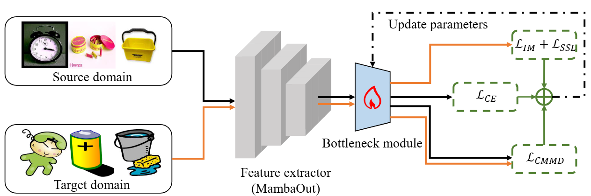

# Official code base for MambaOut-DA: Reforming Unsupervised Domain Adaptation with MambaOut in an Efficient Manner.
## Author: Yihang Wu, Ahmad Chaddad.

**Figure 1**. Pipeline of MambaOut-DA based on standard UDA. The process begins with extracting features from both labeled source and unlabeled target domains by a pre-trained MambaOut model (frozen). Furthermore, these features pass through a bottleneck module consisting of two fully connected layers. The output from the bottleneck is used to compute the adaptation loss ($\mathcal{L}_{CMMD},\mathcal{L}_{IM},\mathcal{L}_{SSL}$) and the classification loss ($\mathcal{L}_{CE}$) on the source domain to fine-tune the bottleneck module.

### Table 1: Comparison with SOTA methods on **Office-31**. The best performance is marked in **bold**. The methods above the horizontal line are CNN-based methods, while the methods below the horizontal line are ViT-based methods.

| Method | A→W | D→W | W→D | A→D | D→A | W→A | Avg. |
| :--- | :--- | :--- | :--- | :--- | :--- | :--- | :--- |
| **CNN-based Methods** | | | | | | | |
| ResNet-50 | 68.4 | 96.7 | 99.3 | 68.9 | 62.5 | 60.7 | 76.1 |
| DANN | 82.0 | 96.9 | 99.1 | 79.7 | 68.2 | 67.4 | 82.2 |
| rRGrad+CAT | 94.4 | 98.0 | **100** | 90.8 | 72.2 | 70.2 | 87.6 |
| SAFN+ENT | 90.1 | 98.6 | 99.8 | 90.7 | 73.0 | 70.2 | 87.1 |
| CDAN+TN | 95.7 | 98.7 | **100** | 94.0 | 73.4 | 74.2 | 89.3 |
| TAT | 92.5 | 99.3 | **100** | 93.2 | 73.1 | 72.1 | 88.4 |
| SHOT | 90.1 | 98.4 | 99.9 | 94.0 | 74.7 | 74.3 | 88.6 |
| MDD+SCDA | 95.3 | 99.0 | **100** | 95.4 | 77.2 | 75.9 | 90.5 |
| **ViT-based Methods** | | | | | | | |
| ViT | 91.2 | 99.2 | **100** | 93.6 | 80.7 | 80.7 | 91.1 |
| TVT | 96.4 | 99.4 | **100** | 96.4 | 84.9 | 86.1 | 93.9 |
| CDTrans | 96.7 | 99.0 | **100** | 97.0 | 81.1 | 81.9 | 92.6 |
| SSRT | 97.7 | 99.2 | **100** | 98.6 | 83.5 | 82.2 | 93.5 |
| PMTrans | **99.5** | 99.4 | **100** | **99.8** | **86.7** | **86.5** | **95.3** |
| EUDA | 95.3 | **100** | **100** | 93.4 | 80.5 | 82.9 | 92.0 |
| **MambaOut-based Method** | | | | | | | |
| **Ours** | 97.2 | **100** | **100** | 96.8 | 84.1 | 85.8 | 94.0 |

### Table 2: Test accuracy on the **Office-Home** dataset. The best performance is marked in **bold**. The methods above the horizontal line are CNN-based methods, while the methods below the horizontal line are ViT-based methods.

| Method | Ar→Cl | Ar→Pr | Ar→Re | Cl→Ar | Cl→Pr | Cl→Re | Pr→Ar | Pr→Cl | Pr→Re | Re→Ar | Re→Cl | Re→Pr | Avg. |
| :--- | :--- | :--- | :--- | :--- | :--- | :--- | :--- | :--- | :--- | :--- | :--- | :--- | :--- |
| **CNN-based Methods** | | | | | | | | | | | | | |
| ResNet-50 | 44.9 | 66.3 | 74.3 | 51.8 | 61.9 | 63.6 | 52.4 | 39.1 | 71.2 | 63.8 | 45.9 | 77.2 | 59.4 |
| MinEnt | 51.0 | 71.9 | 77.1 | 61.2 | 69.1 | 70.1 | 59.3 | 48.7 | 77.0 | 70.4 | 53.0 | 81.0 | 65.8 |
| SAFN | 52.0 | 71.7 | 76.3 | 64.2 | 69.9 | 71.9 | 63.7 | 51.4 | 77.1 | 70.9 | 57.1 | 81.5 | 67.3 |
| CDAN+E | 54.6 | 74.1 | 78.1 | 63.0 | 72.2 | 74.1 | 61.6 | 52.3 | 79.1 | 72.3 | 57.3 | 82.8 | 68.5 |
| DCAN | 54.5 | 75.7 | 81.2 | 67.4 | 74.0 | 76.3 | 67.4 | 52.7 | 80.6 | 74.1 | 59.1 | 83.5 | 70.5 |
| BNM | 56.7 | 77.5 | 81.0 | 67.3 | 76.3 | 77.1 | 65.3 | 55.1 | 82.0 | 73.6 | 57.0 | 84.3 | 71.1 |
| SHOT | 57.1 | 78.1 | 81.5 | 68.0 | 78.2 | 78.1 | 67.4 | 54.9 | 82.2 | 73.3 | 58.8 | 84.3 | 71.8 |
| ATDOC-NA | 58.3 | 78.8 | 82.3 | 69.4 | 78.2 | 78.2 | 67.1 | 56.0 | 82.7 | 72.0 | 58.2 | 85.5 | 72.2 |
| **ViT-based Methods** | | | | | | | | | | | | | |
| ViT | 54.7 | 83.0 | 87.2 | 77.3 | 83.4 | 85.6 | 74.4 | 50.9 | 87.2 | 79.6 | 54.8 | 88.8 | 75.5 |
| TVT | 74.9 | 86.8 | 89.5 | 82.8 | 88.0 | 88.3 | 79.8 | 71.9 | 90.1 | 85.5 | 74.6 | 90.6 | 83.6 |
| CDTrans | 68.8 | 85.0 | 86.9 | 81.5 | 87.1 | 87.3 | 79.6 | 63.3 | 88.2 | 82.0 | 66.0 | 90.6 | 80.5 |
| SSRT | 75.2 | 89.0 | 91.1 | 85.1 | 88.3 | 90.0 | *85.0* | 74.2 | 91.3 | 85.7 | *78.6* | *91.8* | 85.4 |
| PMTrans | **81.3** | **92.9** | **92.8** | **88.4** | **93.4** | **93.2** | **87.9** | **80.4** | **93.0** | **89.0** | **80.9** | 84.8 | **89.0** |
| EUDA | 75.1 | 84.9 | 87.0 | 81.4 | 85.5 | 86.2 | 75.8 | 70.1 | 86.7 | 84.8 | 77.6 | 90.9 | 82.2 |
| DoT | 72.9 | 89.8 | 90.3 | 81.8 | 89.6 | 90.1 | 81.2 | 70.6 | 92.4 | 82.9 | 72.2 | 90.8 | 83.7 |
| **MambaOut-based Method** | | | | | | | |
| **Ours** | *77.9* | *92.3* | *92.4* | *86.0* | *91.6* | *92.1* | 84.3 | *77.3* | *92.7* | *86.3* | 78.5 | **93.7** | *87.1* |

## Table 3: Comparison with SOTA methods on the **Visda-2017**. The best performance is marked in **bold**. The methods above the horizontal line are CNN-based methods, while the methods below the horizontal line are ViT-based methods.

| Method | plane | bcycl | bus | car | horse | knife | mcycl | person | plant | sktbrd | train | truck | Avg. |
| :--- | :--- | :--- | :--- | :--- | :--- | :--- | :--- | :--- | :--- | :--- | :--- | :--- | :--- |
| **CNN-based Methods** | | | | | | | | | | | | | |
| ResNet-50 | 55.1 | 53.3 | 61.9 | 59.1 | 80.6 | 17.9 | 79.7 | 31.2 | 81.0 | 26.5 | 73.5 | 8.5 | 52.4 |
| DANN | 81.9 | 77.7 | 82.8 | 44.3 | 81.2 | 29.5 | 65.1 | 28.6 | 51.9 | 54.6 | 82.8 | 7.8 | 57.4 |
| MinEnt | 80.3 | 75.5 | 75.8 | 48.3 | 77.9 | 27.3 | 69.7 | 40.2 | 46.5 | 46.6 | 79.3 | 16.0 | 57.0 |
| SAFN | 93.6 | 61.3 | 84.1 | 70.6 | 94.1 | 79.0 | 91.8 | 79.6 | 89.9 | 55.6 | 89.0 | 24.4 | 76.1 |
| CDAN+E | 85.2 | 66.9 | 83.0 | 50.8 | 84.2 | 74.9 | 88.1 | 74.5 | 83.4 | 76.0 | 81.9 | 38.0 | 73.9 |
| BNM | 89.6 | 61.5 | 76.9 | 55.0 | 89.3 | 69.1 | 81.3 | 65.5 | 90.0 | 47.3 | 89.1 | 30.1 | 70.4 |
| CGDM | 93.7 | 82.7 | 73.2 | 68.4 | 92.9 | 94.5 | 88.7 | *82.1* | 93.4 | 82.5 | 86.8 | 49.2 | 82.3 |
| SHOT | 94.3 | 88.5 | 80.1 | 57.3 | 93.1 | 93.1 | 80.7 | 80.3 | 91.5 | 89.1 | 86.3 | 58.2 | 82.9 |
| DoT | 96.1 | 81.4 | 71.1 | 78.6 | 94.2 | 91.2 | 88.8 | 85.4 | 92.3 | 90.6 | 92.7 | 56.4 | 84.9 |
| **ViT-based Methods** | | | | | | | | | | | | | |
| ViT | 97.7 | 48.1 | 86.6 | 61.6 | 78.1 | 63.4 | 94.7 | 10.3 | 87.7 | 47.7 | 94.4 | 35.5 | 67.1 |
| TVT | 92.9 | 85.6 | 77.5 | 60.5 | 93.6 | 98.2 | 89.4 | 76.4 | 93.6 | 92.0 | 91.7 | 55.7 | 83.9 |
| CDTrans | 97.1 | **90.5** | 82.4 | 77.5 | 96.6 | 96.1 | 93.6 | **88.6** | **97.9** | 86.9 | 90.3 | **62.8** | *88.4* |
| SSRT | *98.9* | 87.6 | *89.1* | **84.8** | 98.3 | *98.7* | *96.3* | 81.1 | *94.9* | *97.9* | 94.5 | 43.1 | **88.8** |
| PMTrans | *99.4* | 88.3 | 88.1 | *78.9* | **98.8** | 98.3 | 95.8 | 70.3 | 94.6 | **98.3** | *96.3* | 48.5 | 88.0 |
| **MambaOut-based Method** | | | | | | | |
| EUDA | **99.5** | 78.1 | **90.6** | 58.1 | *98.5* | 98.5 | **97.8** | 63.4 | 79.8 | 97.3 | **98
